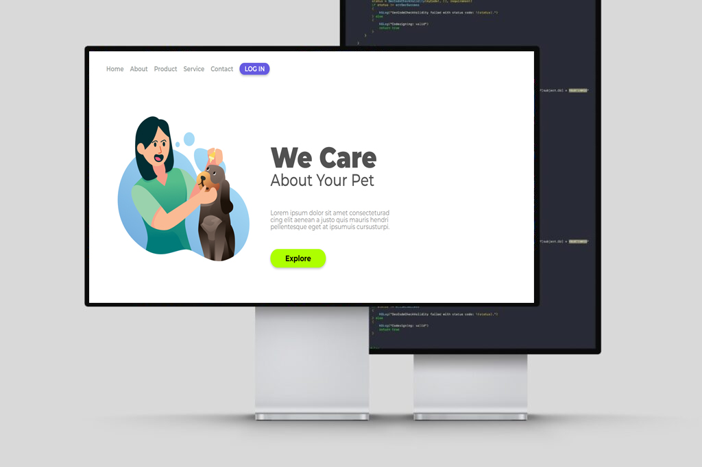

# 📱 Projeto Responsivo

Este projeto é uma demonstração prática de um site responsivo, desenvolvido como parte do meu aprendizado em desenvolvimento web. Utilizando HTML e CSS, o objetivo foi criar uma página que se adapta de forma eficiente a diferentes tamanhos de tela, proporcionando uma experiência consistente em dispositivos móveis, tablets e desktops.

## 🎯 Objetivo

- Aplicar conceitos de **responsividade** utilizando `@media queries`.
- Utilizar **variáveis CSS** para manter a consistência de cores e fontes.
- Praticar a estruturação de páginas com **HTML semântico**.
- Desenvolver um layout que seja **intuitivo e adaptável** a diversos dispositivos.

## 🛠️ Tecnologias Utilizadas

- **HTML5**: Estruturação do conteúdo da página.
- **CSS3**: Estilização e responsividade do layout.
- **Google Fonts**: Tipografia personalizada com as fontes *Krona One* e *Montserrat*.

## 📸 Capturas de Tela

### Versão Desktop

### Versão Mobile

